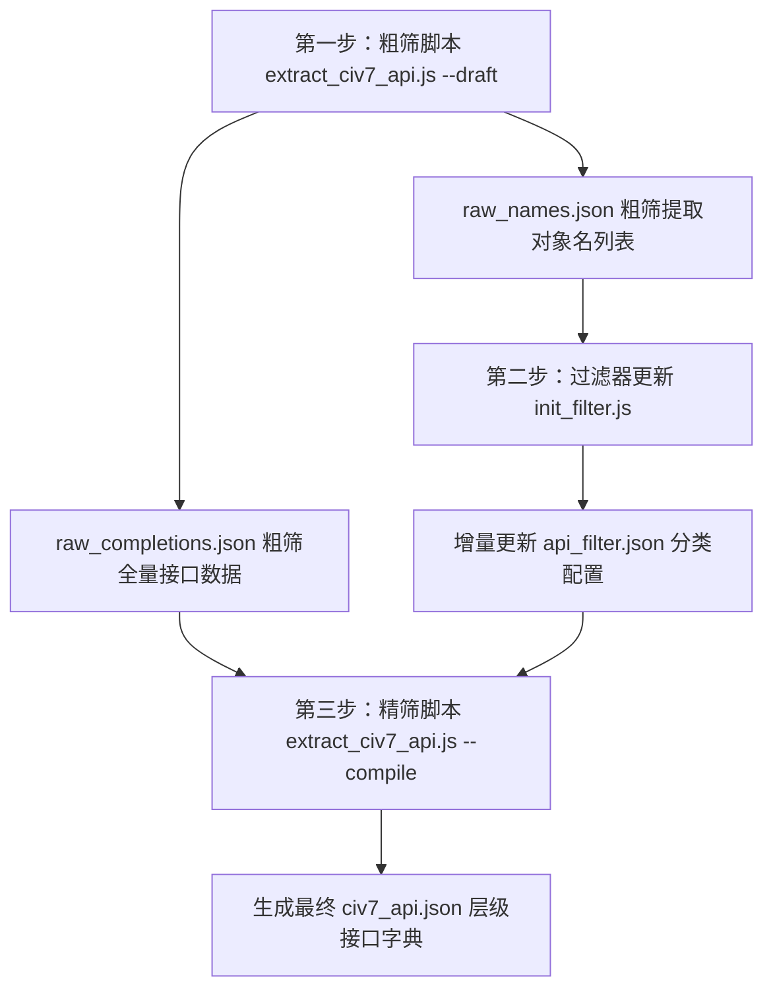

# Civ7 API 提取与精筛编译规范说明书

本文档用于描述 Civ7 模块 API 提取系统的核心机制、配置文件结构以及使用指南。本系统通过“粗筛提取 -> 增量分类过滤 -> 精筛编译输出”三步混合智能架构，实现高覆盖率、零 UI 噪声以及强关联层级的 API 字典生成。

---

## 一、 系统架构与工作流程

提取系统通过两个 Node.js 脚本与一个静态分类文件协同工作，其整体执行流程如下：



### 1. 第一步：粗筛提取 (Draft Mode)
* **执行命令**：`node scripts/extract_civ7_api.js --draft`
* **提取逻辑**：
  * **AST 代码分析**：扫描指定源码目录下的 Source Maps (`.js.map`) 以及 Tuner 调试面板文件 (`.ltp`)，提取 AST 语法树中的方法调用与属性访问符号。
  * **宿主实例动态匹配**：根据分类配置文件声明的合法实例类型（如 `player`），动态匹配源码中如 `pPlayer`、`unitId` 等对应变量上的方法与属性调用。
  * **导出数据**：
    * [raw_completions.json](file:///d:/Games Design/Civ7_mod/Civ7_API/docs/data/raw_completions.json)：包含全量粗筛接口（方法名、形参、返回值）的层级化临时文件。
    * [raw_names.json](file:///d:/Games Design/Civ7_mod/Civ7_API/docs/data/raw_names.json)；所有被识别到的顶层大写符号（类名、全局变量名、枚举等）的去重列表。

### 2. 第二步：过滤器更新与分类决策 (Filter Update & Decision)
* **执行命令**：`node scripts/init_filter.js`
* **工作机制**：
  * 读取最新的 `raw_names.json`，并将其与现有的分类配置文件 [api_filter.json](file:///d:/Games Design/Civ7_mod/Civ7_API/docs/data/api_filter.json) 进行增量合并。
  * 脚本内置关键字规则，自动对新发现的顶层对象进行分类预处理（如将含 `Context`、`Model` 的符号预分至 UI 组件，大写单词或 `Types` 结尾的分至枚举）。
  * 凡无法自动归类的新符号均放入 `unknown` 悬挂隔离区，交由人工或 AI 进行审查并剪切归入各分类，直至清空 `unknown` 列表以达成闭合状态。

### 3. 第三步：精筛编译 (Compile Mode)
* **执行命令**：`node scripts/extract_civ7_api.js --compile`
* **编译机制**：
  * **熔断拦截**：检查 `api_filter.json` 中的 `unknown` 是否已清空，以及是否有未分类的新对象。若存在未分类对象，立即终止编译。
  * **黑名单硬过滤**：自动剔除精筛字典中归在 `ui_components` 与 `ignored` 下的顶层对象。同时，对全局或实例下的二级子系统组件（如 `player.Culture`），只要其名字落入这两个黑名单，也会被直接拦截丢弃。
  * **双向级联注入**：根据 `instances` 声明的获取路径，反向解析全局管理器名称，在编译时将实例接口自动挂载至其对应的全局对象下。
  * **导出数据**：生成最终的层级化 API 字典 [civ7_api.json](file:///d:/Games Design/Civ7_mod/Civ7_API/docs/data/civ7_api.json)。

---

## 二、 过滤器配置文件规范

[api_filter.json](file:///d:/Games Design/Civ7_mod/Civ7_API/docs/data/api_filter.json) 是控制精筛编译行为的核心文件。其键值对严格按照以下顺序进行分类与定义：

### 1. `globals`
* **说明**：大写顶层全局管理器、单例或引擎层核心全局对象名称的白名单。
* **示例**：`"Players"`, `"Units"`, `"Districts"`, `"GameplayMap"`, `"Game"`
* **行为**：本列表中定义的对象在精筛编译后，其对应的方法和属性将以顶层对象的形式输出在 API 字典的 `globals` 节点下。

### 2. `instances`
* **说明**：定义宿主实例（如 `player`）与其常用全局管理器获取路径的双向映射字典。
* **示例**：
  ```json
  "instances": {
    "player": "Players.get(playerId)",
    "unit": "Units.get(unitId)",
    "city": "Cities.get(cityId)",
    "district": "Districts.get(districtId)",
    "constructible": "Constructibles.get(constructibleId)",
    "army": "Armies.get(unit.armyId)",
    "plot": "GameplayMap.getPlot(x, y)"
  }
  ```
* **行为**：
  * **提取期**：作为变量宿主的识别源，启发式地打捞局部代码中对对应实例的方法及属性调用。
  * **编译期**：根据 `getPath` 自动反向推演其全局管理器，并在对应的全局管理器下动态注入该实例的级联关系。例如，根据 `"army": "Armies.get(unit.armyId)"`，最终的全局管理器 `Armies` 下将自动生成 `"instances": { "army": "Armies.get(unit.armyId)" }` 的描述。

### 3. `enums`
* **说明**：大写顶层常量或枚举类型的白名单。
* **示例**：`"YieldTypes"`, `"AgeType"`, `"AdvisorTypes"`
* **行为**：本列表中的符号（无论是 TS 原生声明的 `enum` 还是大写伪全局常量对象），在编译时其成员都会被规范整合，并合并输出至 API 字典的 `enums` 节点下。

### 4. `ui_components`
* **说明**：UI 组件、对话框、界面控制器或 UI 数据模型大写名称的黑名单。
* **示例**：`"LeaderSelectModel"`, `"DialogBox"`, `"FxsScrollable"`
* **行为**：黑名单硬拦截。本列表中的对象将从顶层被直接丢弃，并且如果二级子系统组件名存在于此黑名单，同样会被拦截过滤。

### 5. `ignored`
* **说明**：引擎底层无关机制、辅助工具或第三方依赖模块大写符号名称的黑名单。
* **示例**：`"Achievements"`, `"Benchmark"`, `"FireTuner"`
* **行为**：黑名单硬拦截。同上，被此列表命中的项（不论是顶层还是二级组件）均会被精筛编译直接过滤丢弃。

### 6. `unknown`
* **说明**：增量提取中，新发现但尚未分类判定的对象名称暂存区。
* **示例**：`[]`（熔断前可能悬挂有新符号）
* **行为**：用于保护 API 接口的闭合。编译前该数组必须清空，否则编译将触发拦截熔断。

---

## 三、 API 输出数据结构 (civ7_api.json)

最终生成的层级化字典文件 [civ7_api.json](file:///d:/Games Design/Civ7_mod/Civ7_API/docs/data/civ7_api.json) 包含以下节点结构：

```json
{
  "version": 3.2,
  "globals": {
    "全局管理器名": {
      "methods": {
        "方法名": {
          "params": ["参数名1", "参数名2"],
          "return_type": "返回值类型"
        }
      },
      "properties": {
        "属性名": { "type": "类型" }
      },
      "instances": {
        "挂载实例名": "获取实例的级联路径"
      },
      "sub_objects": {
        "全局子系统组件名": {
          "methods": {},
          "properties": {}
        }
      }
    }
  },
  "instances": {
    "实例名 (如 unit)": {
      "methods": {},
      "properties": {},
      "sub_objects": {
        "实例级联子系统组件 (如 Combat)": {
          "methods": {},
          "properties": {}
        }
      }
    }
  },
  "enums": {
    "枚举名": {
      "members": {
        "成员名": "成员值"
      },
      "description": "枚举描述说明"
    }
  }
}
```

---

## 四、 编译后验证规范

编译成功后，可通过以下四个指标来检验输出文件数据的正确性与完整性：
1. **Instances 节点**：应包含 `player`、`unit`、`city`、`district`、`constructible`、`army` 和 `plot` 完整的 7 个实例；
2. **实例方法/属性打捞**：新识别的 `army` 和 `constructible` 下应提取出对应的方法和属性，不为空；
3. **全局级联自动推导绑定**：全局对象 `Districts`、`Constructibles` 和 `Armies` 下必须具有正确的 `instances` 字典映射，表示双向绑定正常；
4. **子系统排除隔离**：在 `instances.unit.sub_objects` 下应保留 `Combat`、`Health`、`Experience` 等游戏核心子系统，且 UI 干扰组件不应在此处出现。
