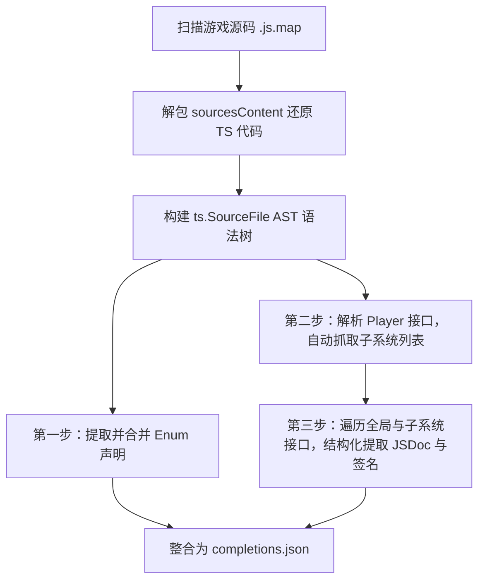

# Civ7 API & Constants 自动提取脚本设计方案

经过与用户的共识，我们确立了基于 **Node.js + TypeScript Compiler AST 解析** 的 Civ7 API 提取脚本制作方案。该脚本将摆脱落后的“正则特征匹配”机制，直接对符号表反解出的原始 TS 定义进行高精度的语义提取。

---

## 运行与技术架构

* **文件位置**：`scripts/extract_civ7_api.js` (或 `.ts`，通过 `ts-node` 执行)
* **技术栈**：Node.js + `typescript` (AST 语法分析包)
* **数据源**：`D:\Games Design\Civ7_mod\.官方变动` 目录下的 `.js.map` 映射文件
* **输出路径**：`docs/data/completions.json` (提供给 Linter 与文档补全流程读取)

---

## 核心实现步骤



### 1. 源码反解与 AST 构建
1. 遍历游戏目录中 `modules/` 和 `TunerPanels/` 下的所有 `.js.map` 文件；
2. 读取 map 文件的 `sourcesContent` 字段，将其在内存中反解为虚拟的 TypeScript 源码文本；
3. 调用 `typescript` 编译器的接口构建 AST：
   ```javascript
   const sourceFile = ts.createSourceFile(
       filePath,
       sourceText,
       ts.ScriptTarget.Latest,
       true
   );
   ```

### 2. Enums (常量与枚举) 自动提取
* 遍历 AST 节点，匹配 `ts.SyntaxKind.EnumDeclaration`；
* 提取枚举名称、各成员的键值对定义（如 `ANTIQUITY = 0`）；
* 提取枚举成员上方的 `ts.getJSDocComments`，获得字段的释义说明。

### 3. 全局对象与子系统 (Sub-Objects) 自动发现
* **路径过滤**：排除非游戏自身的第三方噪声代码；
* **全局对象定位**：直接锁定 `KNOWN_GLOBALS`（如 `GameplayMap`）对应的 `interface` 或 `class` 定义；
* **子系统自动抓取 (依赖链匹配)**：
  - 寻找 `interface Player` (或 `IPlayer`) 声明节点；
  - 遍历其下所有的属性成员（如 `Treasury: ITreasury;`，`Culture: ICulture;`）；
  - **自动收集** 属性对应的接口类型（如 `ITreasury`、`ICulture`），将其动态加入待提取的子系统白名单中。

### 4. 成员属性与 JSDoc 结构化提取
对于所有定位到的全局/子系统接口，遍历其方法与属性成员：
* **形参名与类型**：通过 `node.parameters` 提取形参名（绝对准确的变量名而非实参变量）与类型注解；
* **返回值类型**：读取 `node.type` 获取返回值类型（包含泛型支持）；
* **结构化 JSDoc 提取**：
  - 调用 `ts.getJSDocTags(node)` 遍历注释标签；
  - 提取 `@param` 对应的参数说明，归入对应的参数对象；
  - 提取 `@returns` 对应的返回值说明，存入 `return_description`；
  - 提取主注释段落存入 `description`。

---

## 输出数据格式设计 (JSON)

提取出的数据将以 JSON 结构化存储，便于校验脚本和自动补全工作流进行毫秒级的数据匹配与读取：

```json
{
  "version": 2,
  "globals": {
    "GameplayMap": {
      "methods": {
        "getGridWidth": {
          "params": [],
          "return_type": "number",
          "description": "获取游戏地图的总格子宽度。"
        },
        "getContinentType": {
          "params": [
            {
              "name": "x",
              "type": "number",
              "description": "地块的 X 坐标。"
            },
            {
              "name": "y",
              "type": "number",
              "description": "地块的 Y 坐标。"
            }
          ],
          "return_type": "number",
          "description": "获取指定坐标的地块的大陆类型。"
        }
      },
      "properties": {}
    }
  },
  "sub_objects": {
    "Treasury": {
      "methods": {
        "getBalance": {
          "params": [],
          "return_type": "number",
          "description": "获取玩家的国库当前金币余额。"
        }
      }
    }
  },
  "enums": {
    "AgeType": {
      "description": "游戏时代枚举",
      "members": {
        "ANTIQUITY": 0,
        "EXPLORATION": 1,
        "MODERN": 2
      }
    }
  }
}
```

---

## 验证与发布

1. **测试脚本运行**：在 `scripts/` 下执行 `node extract_civ7_api.js`，确认其能在 5 秒内提取并生成 JSON；
2. **校验比对**：将生成后的 `completions.json` 与已有文档进行对照，验证方法和参数名称是否精确对应。
