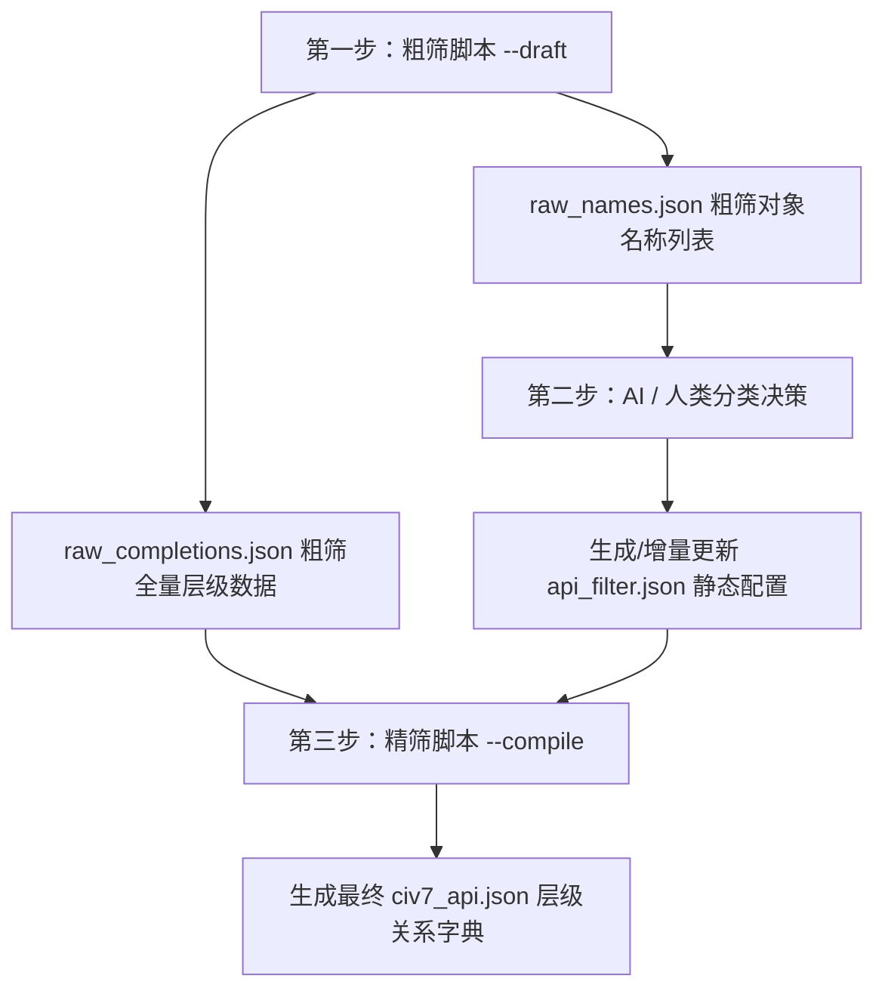

# Civ7 API & Constants 三步混合智能提取方案

为了在保证提取的高覆盖率的同时，彻底过滤掉前端 UI 组件及第三方依赖库的庞大噪音，并完美解决常量枚举被误判为全局对象的问题，我们设计了 **“脚本粗筛 -> AI 极简研判分类 -> 脚本编译精筛”** 的三步混合智能提取架构。

为了真实且清晰地表达 Civ7 API 中**“全局管理器 -> 实例 -> 子系统组件”**的层层展开关系，我们将数据模型进行了深度升级。

---

## 一、 核心概念与层级数据模型

Civ7 的 API 并不是扁平的全局和子系统，而是具有清晰的面向对象和组件化的层级结构：

1. **全局对象 (Globals)**：直接从全局环境注入的管理器或单例，如 `GameplayMap`、`Players`、`Units`、`Cities`、`Game`、`Input`、`InterfaceMode` 等。
2. **实例对象 (Instances)**：由全局对象的方法（如 `Players.get(id)` 或 `Units.get(id)`）返回的实体实例。主要包含：
   - **`Player` 实例**：拥有实例属性（如 `id`），实例方法（如 `isHuman()`），以及下属**玩家子系统 (Player Sub-systems)**（如 `Treasury`、`Culture`、`Diplomacy`）。
   - **`Unit` 实例**：拥有实例属性（如 `id`、`type`、`location`），以及下属**单位子系统 (Unit Sub-systems)**（如 `Health`、`Combat`、`Experience`、`Religion`）。
   - **`City` 实例**：拥有下属**城市子系统 (City Sub-systems)**（如 `BuildQueue`、`Growth`、`Production`）。
   - **`Plot` 实例**：地块实例，拥有地块方法与属性。
3. **常量与枚举 (Enums)**：各系统通用的常量定义（如 `YieldTypes`、`AgeType`）。

### 整体架构与运行流程



---

## 二、 配置文件结构定义

### 1. 分类配置文件 `api_filter.json`
`api_filter.json` 主要用来决定哪些名称是全局对象，哪些是实例的下属子系统，哪些是常量枚举，哪些是 UI 噪声。
```json
{
  "globals": [
    "GameplayMap",
    "Players",
    "Units",
    "Cities",
    "Game",
    "Input",
    "InterfaceMode"
  ],
  "sub_objects": [
    "Treasury",
    "Culture",
    "Diplomacy",
    "Health",
    "Combat",
    "Experience",
    "Religion",
    "BuildQueue",
    "Growth",
    "Production"
  ],
  "enums": [
    "AgeType",
    "YieldTypes",
    "AdvisorTypes"
  ],
  "ui_components": [
    "AppHeader",
    "LeaderImage",
    "TutorialItem"
  ],
  "ignored": [
    "SolidJS",
    "Vite"
  ]
}
```

### 2. 完美的层级化 `civ7_api.json` 输出样例
为了展现层层展开的级联关系，最终的 `civ7_api.json` 采用如下结构：
```json
{
  "version": 3,
  "globals": {
    "GameplayMap": {
      "methods": {
        "getGridWidth": { "params": [] }
      },
      "properties": {}
    },
    "Units": {
      "methods": {
        "get": {
          "params": ["unitId"],
          "return_type": "Unit"
        }
      }
    }
  },
  "instances": {
    "Player": {
      "methods": {
        "isHuman": { "params": [] }
      },
      "properties": {
        "id": {}
      },
      "sub_objects": {
        "Treasury": {
          "methods": {
            "getBalance": { "params": [], "return_type": "number" }
          }
        }
      }
    },
    "Unit": {
      "methods": {},
      "properties": {
        "id": {},
        "type": {},
        "location": { "type": "PlotCoord" }
      },
      "sub_objects": {
        "Health": {
          "methods": {
            "getDamage": { "params": [], "return_type": "number" }
          }
        },
        "Combat": {
          "methods": {
            "getStrength": { "params": [] }
          }
        }
      }
    }
  },
  "enums": {
    "AgeType": {
      "members": {
        "ANTIQUITY": 0,
        "EXPLORATION": 1
      }
    }
  }
}
```

---

## 三、 三步走详细提取规范

### 1. 第一步：粗筛 (`--draft`)
* **变量接收器实例识别**：
  * 若调用形如 `variable.method()`，通过启发式分析 `variable` 确定其所属实例：
    - `player`, `p`, `pPlayer`, `localPlayer` $\rightarrow$ 归为 `Player` 实例方法。
    - `unit`, `u`, `pUnit`, `selectedUnit` $\rightarrow$ 归为 `Unit` 实例方法.
    - `city`, `c`, `pCity` $\rightarrow$ 归为 `City` 实例方法。
    - `plot`, `pPlot` $\rightarrow$ 归为 `Plot` 实例方法。
    - 首字母大写 (如 `GameplayMap`) $\rightarrow$ 归为全局对象。
  * 若调用形如 `variable.SubObject.method()`：
    - 分析 `variable` 的实例类型，并将 `SubObject`（如 `Health`）作为该实例的 `sub_objects` 成员进行注册与方法提取。
* **输出**：
  - `docs/data/raw_completions.json`：全量层级提取的粗筛文件。
  - `docs/data/raw_names.json`：全部提取到的对象名（包含全局对象、子系统、常量枚举）。

### 2. 第二步：AI / 人工分类与过滤器 (`api_filter.json`)
* 将 `raw_names.json` 中的各对象名归入五大分类。
* 特别注意：**`Units`**、**`Cities`**、**`Players`** 必须归入 `globals`，而其下属组件如 **`Health`**、**`Treasury`**、**`BuildQueue`** 归入 `sub_objects`。

### 3. 第三步：精筛编译 (`--compile`)
* 从 `raw_completions.json` 中读取层级数据，并根据 `api_filter.json` 的分类进行精筛整合。
* 只有归在 `globals` 的对象输出到顶层 `globals` 下。
* 只有归在 `sub_objects` 且在粗筛中被归于相应实例下的组件，才会输出到 `instances[InstanceName].sub_objects[SubObjectName]` 下。
* 常量与大写伪全局对象（如 `YieldTypes`）全部剪切归入 `enums` 下。
* 剔除所有空白描述，参数全量扁平化。
